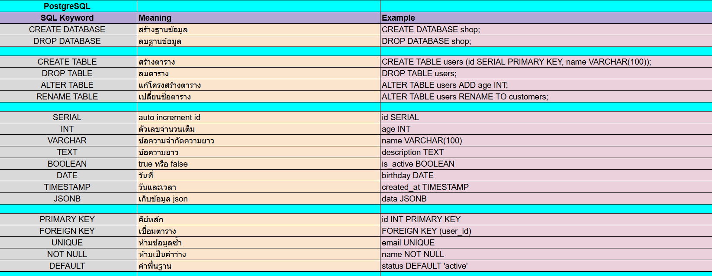

##ความเข้าใจใน PostgreSQL คือ
การจัดเก็บข้อมูลที่จัดอยู่ในรูปแบบของตาราง(Tables) ที่มี แถว(Rows) และ คอลัมน์(Columms) ที่สามารถสร้างข้อมูล(C) อ่านข้อมูล(R)แก้ไขข้อมูล(U) และลบข้อมูลได้(D) หรือเรียกว่า CRUD operations

##สิ่งที่สำคัญที่ประกอบใน PostgreSQL คือ
Indices:เพื่อลดเวลาในการตรวจสอบข้อมูล
Views:ช่วยให้เราสามารถเรียกใช้คิวรีที่ซับซ้อนได้ง่ายขึ้นเหมือนเรียกใช้ตารางปกติ
Triggers:ระบบทำงานอัตโนมัติที่จะประมวลผลเมื่อเกิดเหตุการณ์ที่กำหนด เช่น การตรวจสอบข้อมูลก่อนเพิ่มลงตาราง (INSERT) หรือการเก็บ Log เมื่อมีการแก้ไขข้อมูล

##ฟังก์ชันของ PostgreSQL มายได้ลองศึกษาและทำสรุปโค้ดไว้บ้างส่วนค่ะดังรูป

