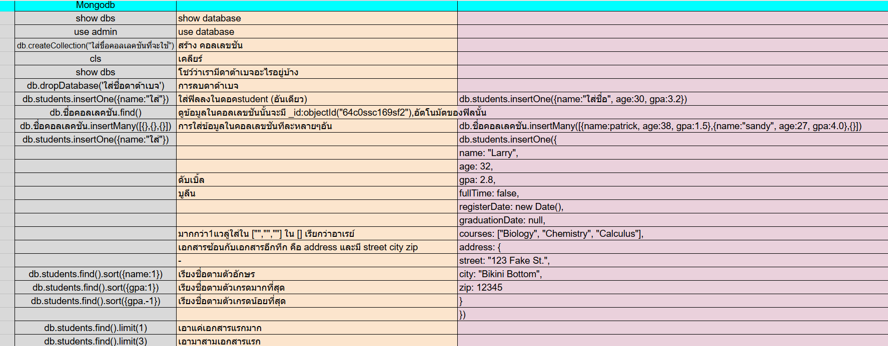

##MongoDB คือระบบจัดการฐานข้อมูลประเภท NoSQL ที่ได้รับความนิยมสูง โดยมีลักษณะเด่นคือการเก็บข้อมูลในรูปแบบ Document-based

ความเข้าใจของมายคือจะนึกภาพเป็นโรงเรียนค่ะ คือ Database คือโรงเรียน โดยมี คุณครู นักเรียน และวิชาเรียนเป็น Document ของโรงเรียน (Database) ดังนั้น ในรายละเอียดของ คุณครู นักเรียน และวิชาเรียนก็จะมี Key and Values หรือ Field อยู่ด้านใน เช่น นักเรียน ชื่อ:กล้า อายุ:17 และอาจจะมีการใช้ Array เพื่อ เก็บข้อมูลหลายค่าไว้ใน Field เดียว โดยใช้เครื่องหมายโดยใช้เครื่องหมาย [] แต่การใช้งานโดยเรียก index ซึ่งจะต่างกับอีกตัวคือ Object {} จะไม่มี index ใช้เก็บข้อมูลที่มีรายละเอียดหลายส่วน เช่น ที่อยู่ ซึ่งอาจมีเมือง ประเทศ และรหัสไปรษณีย์ เก็บข้อมูลหลาย Field ซ้อนกันได้ด้วย

มายได้ลองเรียนรู้เพิ่มเติมและจดบันทึกโต้ดไว้บ้างส่วนค่ะ